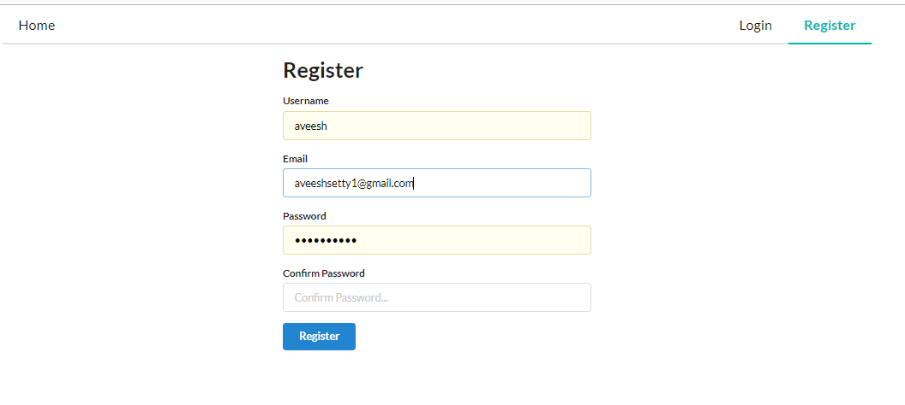
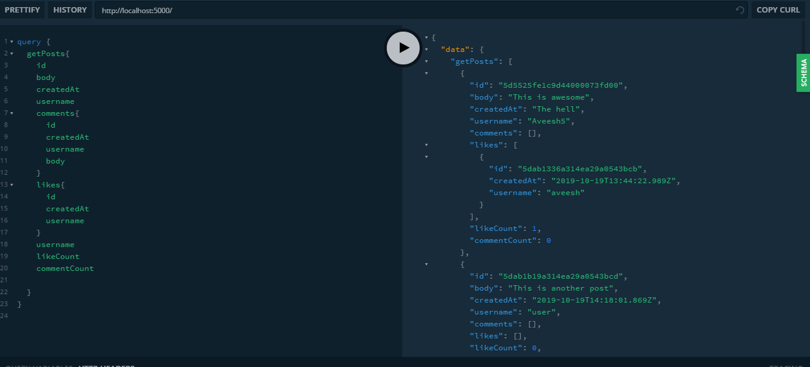
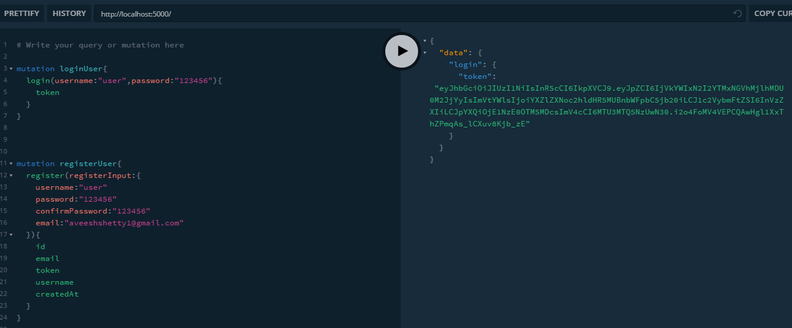
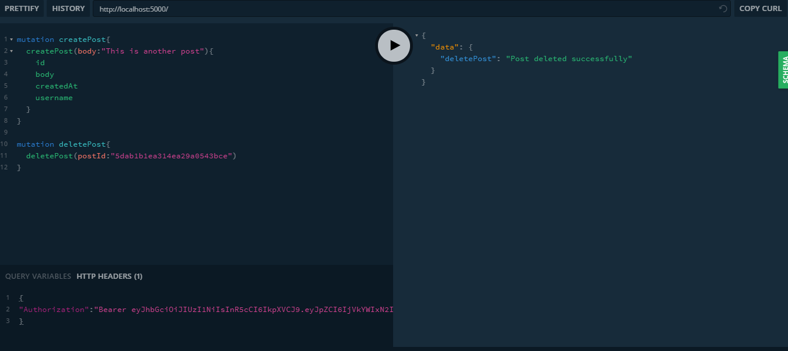

# React GraphQL App

- This is a social media app that uses React as Front end and GraphQL as Backend and MongoDB as database


## Quick Start

Add your MONGO_URI to the default.json file. Make sure you set an env var for that and the jwtSecret on deployment

```bash
# Install dependencies for server
npm install

# Install dependencies for client
npm install client-install

# Start the GraphQl Server
npm start

# Start the client Server
cd client
npm start

# Server runs on http://localhost:5000 and client on http://localhost:3000
```









